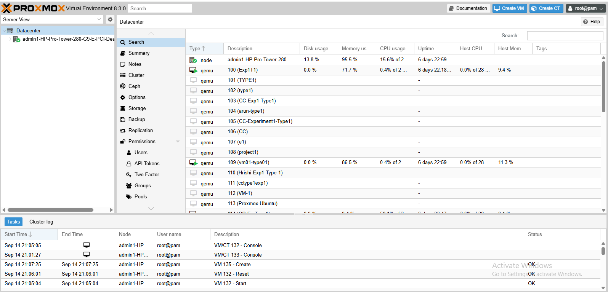
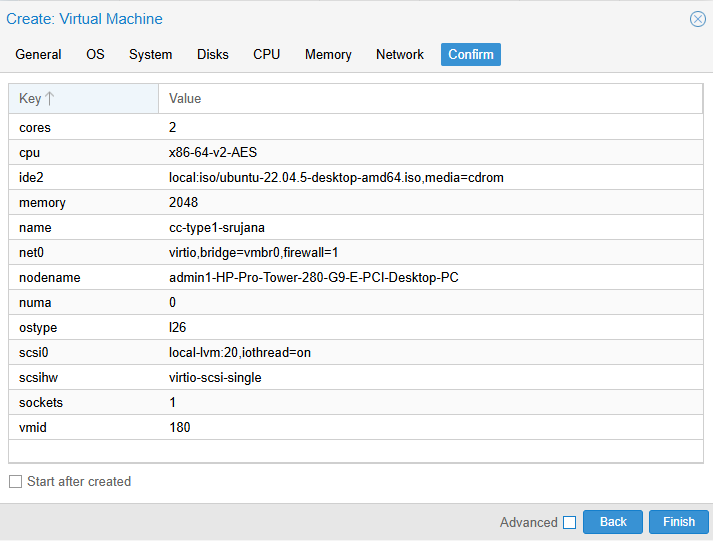
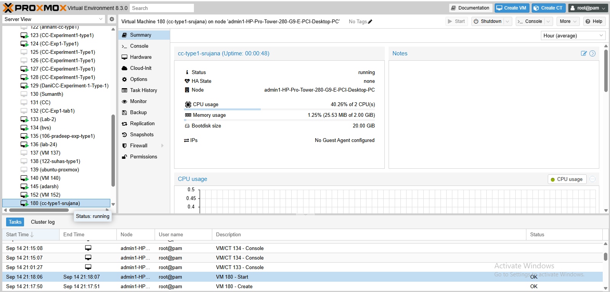
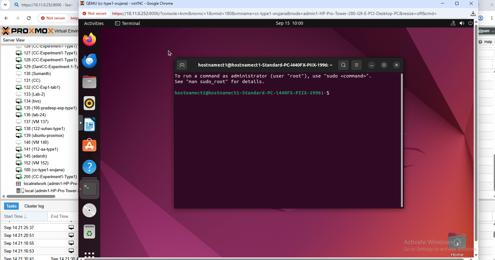
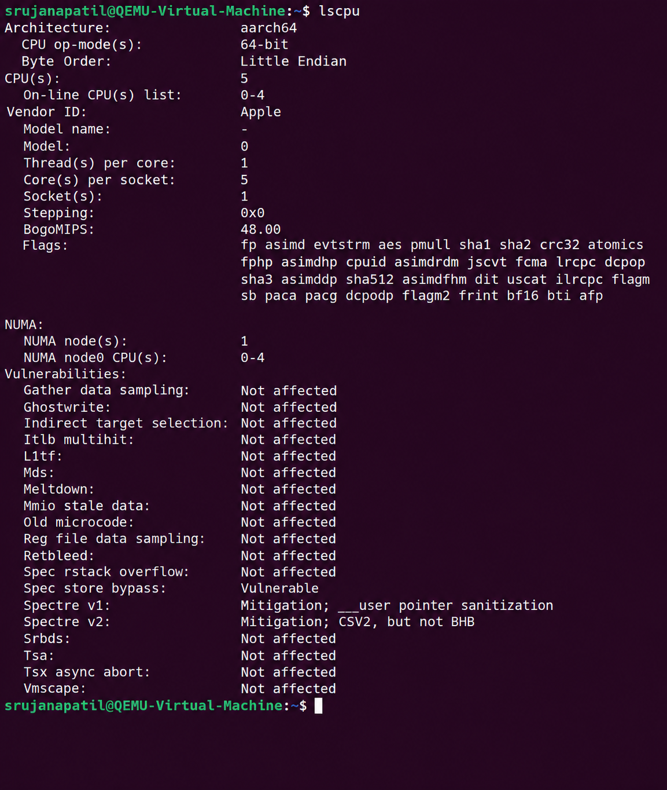
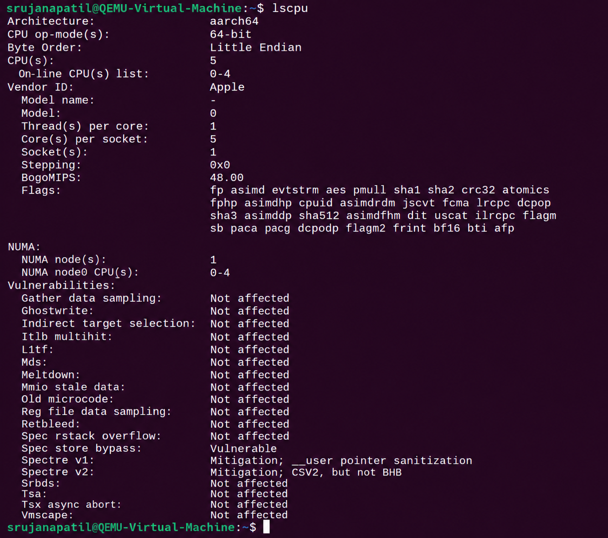

# EXP-01 — Hypervisor Performance Analysis

> **Type-1 vs Type-2 Hypervisor Performance Analysis using Proxmox VE and VMware Workstation**

---

##  Experiment Overview

This experiment studies the CPU performance of virtual machines running on two different hypervisor architectures:

- **Type-1 Hypervisor — Proxmox VE**
- **Type-2 Hypervisor — VMware Workstation**

Ubuntu is used as the guest operating system in both environments. Both virtual machines use an equivalent basic hardware configuration, and CPU performance is evaluated using the **Sysbench CPU benchmark**.

The same benchmark workload is used in both environments to provide a consistent basis for performance analysis.

---

##  Objective

The experiment aims to:

- Understand the difference between Type-1 and Type-2 hypervisors.
- Create and configure an Ubuntu VM using Proxmox VE.
- Create and configure an Ubuntu VM using VMware Workstation.
- Maintain an equivalent virtual hardware configuration.
- Perform CPU benchmarking using Sysbench.
- Record execution time, total events, events per second, and latency.
- Compare the measured performance of both virtualization approaches.
- Observe virtual machine resource utilization.

---

##  Hypervisor Architectures

### Type-1 Hypervisor — Proxmox VE

Proxmox VE is used as the Type-1 hypervisor in this experiment.

A Type-1 hypervisor operates directly on the physical infrastructure and provides virtual machines with virtualized hardware resources.

### Type-2 Hypervisor — VMware Workstation

VMware Workstation is used as the Type-2 hypervisor.

A Type-2 hypervisor operates on top of a host operating system and provides virtualization services to guest virtual machines.

---

##  Virtual Machine Configuration

To make the comparison consistent, both virtual machines use the same intended basic configuration.

| Resource | Configuration |
|---|---|
| Guest Operating System | Ubuntu |
| CPU | `2 vCPU` |
| Memory | `2 GB RAM` |
| Disk | `20 GB` |
| Benchmark | Sysbench CPU |

---

##  Benchmark Method

The same CPU benchmark is used for both virtual machines:

    sysbench cpu --cpu-max-prime=20000 run

The benchmark records:

- Total execution time
- Total number of events
- Events per second
- Minimum latency
- Average latency
- Maximum latency
- 95th percentile latency

---

#  PART A — TYPE-1 HYPERVISOR: PROXMOX VE

## Proxmox VE

Proxmox VE is used as the Type-1 hypervisor.

An Ubuntu virtual machine is created and configured using the standard experimental configuration.

### Proxmox VM Configuration

| Parameter | Value |
|---|---|
| Hypervisor | Proxmox VE |
| Hypervisor Type | Type-1 |
| Guest OS | Ubuntu |
| CPU | 2 vCPU |
| Memory | 2 GB RAM |
| Disk | 20 GB |

### Proxmox Evidence

.png)

.png)

---

#  PART B — TYPE-2 HYPERVISOR: VMWARE WORKSTATION

## VMware Workstation

VMware Workstation is used as the Type-2 hypervisor.

An equivalent Ubuntu virtual machine is created using the same intended CPU, memory, and disk configuration.

### VMware VM Configuration

| Parameter | Value |
|---|---|
| Hypervisor | VMware Workstation |
| Hypervisor Type | Type-2 |
| Guest OS | Ubuntu |
| CPU | 2 vCPU |
| Memory | 2 GB RAM |
| Disk | 20 GB |
| Network | NAT |

### VMware Evidence

---

#  PERFORMANCE ANALYSIS

The same Sysbench CPU benchmark is used on both hypervisors:

    sysbench cpu --cpu-max-prime=20000 run

## Performance Comparison

| Performance Metric | Proxmox VE — Type-1 | VMware Workstation — Type-2 |
|---|---:|---:|
| Guest OS | Ubuntu | Ubuntu |
| CPU | 2 vCPU | 2 vCPU |
| Memory | 2 GB | 2 GB |
| Disk | 20 GB | 20 GB |
| Sysbench Version | `1.0.20` | `1.0.20` |
| Number of Threads | `1` | `1` |
| Prime Number Limit | `20,000` | `20,000` |
| Total Execution Time | `10.0004 s` | `10.0006 s` |
| Total Events | `17,257` | `24,366` |
| Events per Second | `1,725.49` | `2,436.05` |
| Minimum Latency | `0.57 ms` | `0.40 ms` |
| Average Latency | `0.58 ms` | `0.41 ms` |
| Maximum Latency | `1.68 ms` | `4.39 ms` |
| 95th Percentile Latency | `0.62 ms` | `0.42 ms` |
| Latency Sum | `9997.48 ms` | `9992.75 ms` |

### Proxmox Benchmark Observation

The Proxmox VE benchmark completed in **10.0004 seconds**.

The VM processed **17,257 total events** with a throughput of **1,725.49 events per second**.

The measured latency values were:

- Minimum: **0.57 ms**
- Average: **0.58 ms**
- Maximum: **1.68 ms**
- 95th percentile: **0.62 ms**
- Latency Sum: **9997.48 ms**

.png)

### VMware Benchmark Observation

The VMware Workstation benchmark completed in **10.0006 seconds**.

The VM processed **24,366 total events** with a throughput of **2,436.05 events per second**.

The measured latency values were:

- Minimum: **0.40 ms**
- Average: **0.41 ms**
- Maximum: **4.39 ms**
- 95th percentile: **0.42 ms**
- Latency Sum: **9992.75 ms**

---

#  EXPERIMENT WORKFLOW

    Hypervisor Performance Analysis
                 |
        +--------+--------+
        |                 |
        v                 v
    Proxmox VE      VMware Workstation
      Type-1              Type-2
        |                   |
        v                   v
     Ubuntu VM           Ubuntu VM
        |                   |
        v                   v
     Sysbench            Sysbench
        |                   |
        +--------+----------+
                 |
                 v
       Record Benchmark Data
                 |
                 v
        Performance Analysis
                 |
                 v
             Comparison

---

#  PERFORMANCE OBSERVATION

The experiment keeps the guest operating system, intended virtual CPU allocation, memory allocation, disk allocation, and Sysbench workload equivalent across both environments.

The measured results are:

| Metric | Proxmox VE | VMware Workstation |
|---|---:|---:|
| Execution Time | `10.0004 s` | `10.0006 s` |
| Total Events | `17,257` | `24,366` |
| Events per Second | `1,725.49` | `2,436.05` |
| Average Latency | `0.58 ms` | `0.41 ms` |
| Maximum Latency | `1.68 ms` | `4.39 ms` |
| 95th Percentile Latency | `0.62 ms` | `0.42 ms` |

These values provide the measured basis for comparing CPU performance between the two virtualization environments.

---

#  TOOLS & TECHNOLOGIES

| Category | Technology |
|---|---|
| Type-1 Hypervisor | Proxmox VE |
| Type-2 Hypervisor | VMware Workstation |
| Guest Operating System | Ubuntu |
| Benchmark Tool | Sysbench |
| CPU Analysis | `lscpu` |
| Memory Analysis | `free -h` |
| Resource Monitoring | `top` |
| Version Control | Git |
| Repository | GitHub |

---

#  REPOSITORY STRUCTURE

    CC-Experiment-01-Hypervisor-Analysis/
    │
    ├── README.md
    │
    ├── results/
    │   └── performance-analysis.md
    │
    └── screenshots/
        │
        ├── type1-proxmox/
        │   ├── 01-proxmox-dashboard.png
        │   ├── 02-proxmox-vm-configuration.png
        │   ├── 03-proxmox-vm-running.png
        │   ├── 04-proxmox-ubuntu-console.png
        │   ├── 05-proxmox-sys-configuration(1).png
        │   ├── 06-proxmox-sys-configuration(2).png
        │   └── 07-proxmox-resource-monitoring.png
        │
        └── type2-vmware/
            ├── 01-vmware-vm-configuration.png
            ├── 02-vmware-vm-running.png
            ├── 03-vmware-system-configuration.png
            └── 04-vmware-sysbench-result.png

---

#  KEY OBSERVATIONS

- Proxmox VE represents a **Type-1 hypervisor**.
- VMware Workstation represents a **Type-2 hypervisor**.
- Ubuntu is used as the guest operating system in both environments.
- Both virtual machines use equivalent intended hardware resources.
- The same Sysbench CPU benchmark is used for both environments.
- Proxmox VE recorded **1,725.49 events/second**.
- VMware Workstation recorded **2,436.05 events/second**.
- Proxmox VE average latency was **0.58 ms**.
- VMware Workstation average latency was **0.41 ms**.
- The measured values are taken from the recorded benchmark outputs.

---

#  CONCLUSION

This experiment demonstrates the practical performance analysis of virtual machines running on **Proxmox VE (Type-1)** and **VMware Workstation (Type-2)**.

Equivalent Ubuntu virtual machines are created and tested using the same Sysbench CPU workload.

The final benchmark results are:

| Metric | Proxmox VE | VMware Workstation |
|---|---:|---:|
| Execution Time | `10.0004 s` | `10.0006 s` |
| Total Events | `17,257` | `24,366` |
| Events per Second | `1,725.49` | `2,436.05` |
| Average Latency | `0.58 ms` | `0.41 ms` |

The experiment provides a practical basis for analyzing CPU performance under the two different hypervisor architectures.
