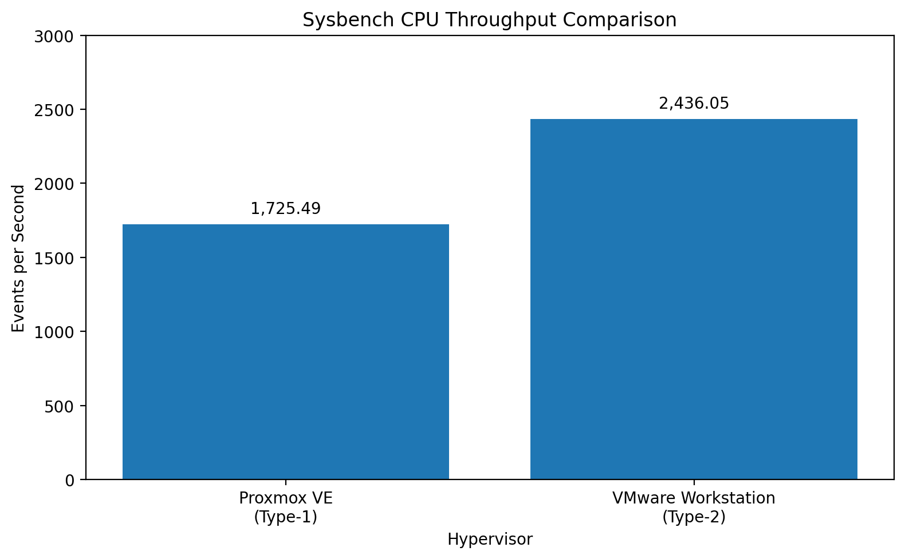

## Performance Comparison

| Performance Metric | Proxmox VE — Type-1 | VMware Workstation — Type-2 |
|---|---:|---:|
| Guest OS | Ubuntu | Ubuntu |
| CPU | 2 vCPU | 2 vCPU |
| Memory | 2 GB | 2 GB |
| Disk | 20 GB | 20 GB |
| Sysbench Version | `1.0.20` | `1.0.20` |
| Number of Threads | `1` | `1` |
| Prime Number Limit | `20,000` | `20,000` |
| Total Execution Time | `10.0004 s` | `10.0006 s` |
| Total Events | `17,257` | `24,366` |
| Events per Second | `1,725.49` | `2,436.05` |
| Minimum Latency | `0.57 ms` | `0.40 ms` |
| Average Latency | `0.58 ms` | `0.41 ms` |
| Maximum Latency | `1.68 ms` | `4.39 ms` |
| 95th Percentile Latency | `0.62 ms` | `0.42 ms` |
| Latency Sum | `9997.48 ms` | `9992.75 ms` |

### Throughput Comparison

The graph above shows the recorded Sysbench CPU throughput for the two virtual machines:

- **Proxmox VE:** `1,725.49 events/second`
- **VMware Workstation:** `2,436.05 events/second`

## Proxmox VE Result

The Proxmox VE VM completed the Sysbench CPU benchmark with:

- **Execution Time:** `10.0004 s`
- **Total Events:** `17,257`
- **Events per Second:** `1,725.49`
- **Average Latency:** `0.58 ms`
- **Minimum Latency:** `0.57 ms`
- **Maximum Latency:** `1.68 ms`
- **95th Percentile Latency:** `0.62 ms`
- **Latency Sum:** `9997.48 ms`

## VMware Workstation Result

The VMware Workstation VM completed the Sysbench CPU benchmark with:

- **Execution Time:** `10.0006 s`
- **Total Events:** `24,366`
- **Events per Second:** `2,436.05`
- **Average Latency:** `0.41 ms`
- **Minimum Latency:** `0.40 ms`
- **Maximum Latency:** `4.39 ms`
- **95th Percentile Latency:** `0.42 ms`
- **Latency Sum:** `9992.75 ms`

## Observation

The measured execution times are very close in this benchmark run.

The recorded throughput was:

- **Proxmox VE:** `1,725.49 events/second`
- **VMware Workstation:** `2,436.05 events/second`

The recorded average latency was:

- **Proxmox VE:** `0.58 ms`
- **VMware Workstation:** `0.41 ms`

## Conclusion

The Sysbench results provide a direct CPU performance comparison between the Proxmox VE Type-1 and VMware Workstation Type-2 virtual machines using the same guest operating system, virtual hardware configuration, and benchmark workload.
