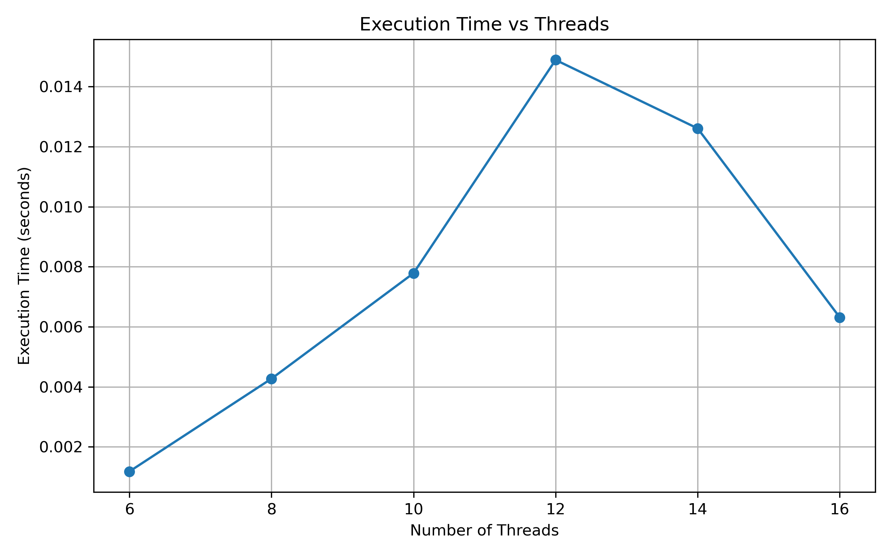
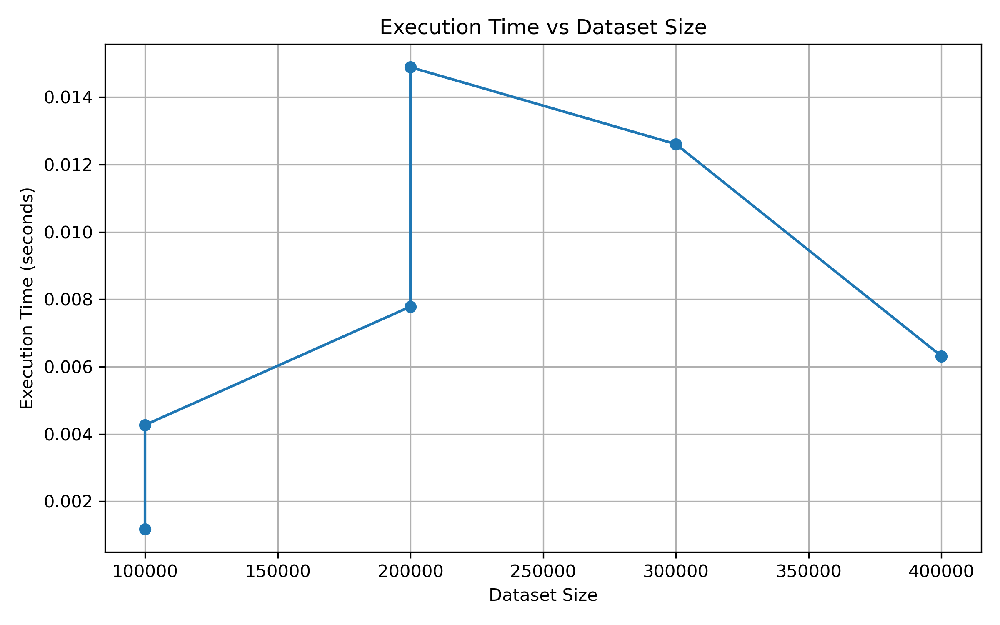
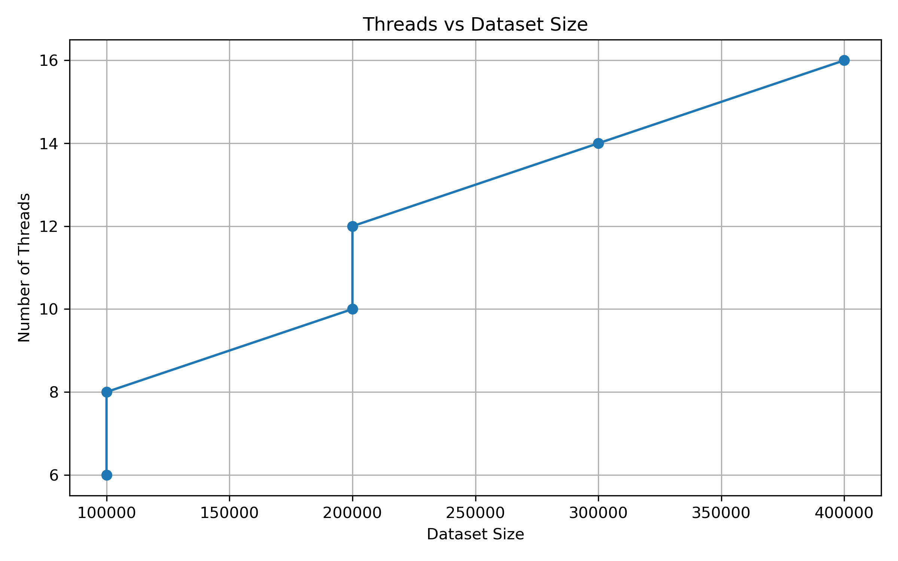
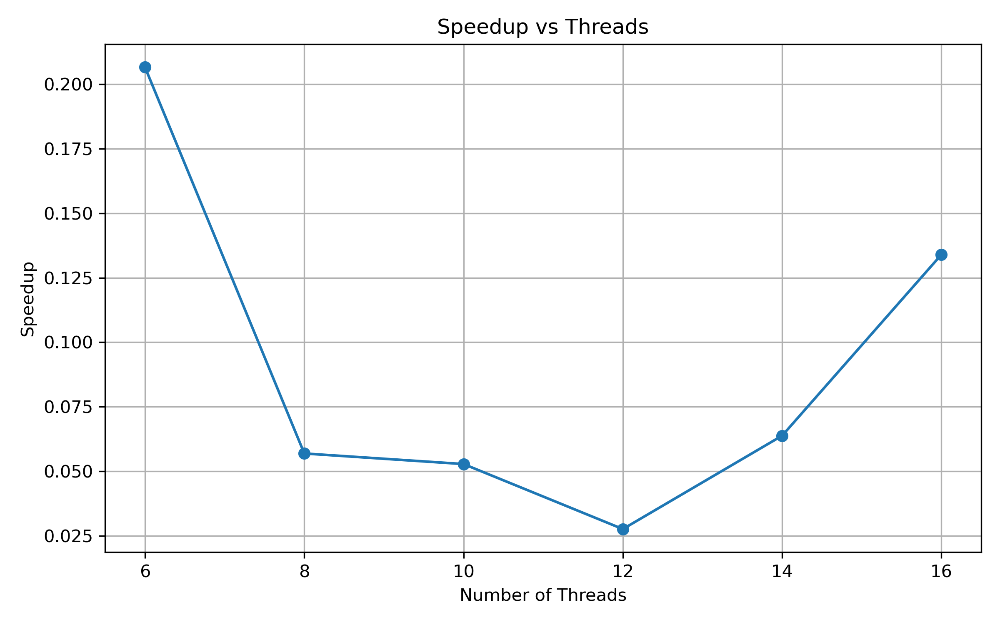
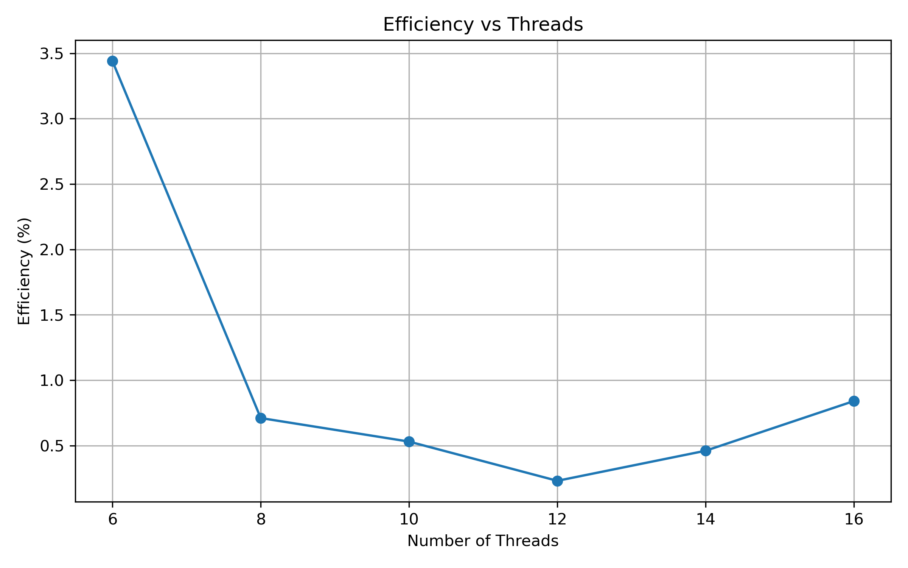

#  Parallel Maximum/Minimum Search using OpenMP

<p align="center">

**Parallel Computing / GPU — Evaluation Experiment**

*Finding the maximum and minimum values in large datasets using OpenMP parallelism.*

</p>

---

##  Experiment Overview

| Item | Details |
|---|---|
| **Experiment** | Parallel Maximum/Minimum Search |
| **Parallel Model** | OpenMP |
| **Language** | C |
| **Dataset** | Generated Integer Dataset |
| **Maximum Dataset Size** | 400,000 values |
| **CPU Processors** | 12 |
| **Performance Metrics** | Execution Time, Speedup, Efficiency |

---

## 1. Problem Statement

Find the maximum and minimum values in a large dataset using parallel processing with OpenMP threads.

---

## 2. Objective

1. Define the maximum and minimum search problem.
2. Implement maximum and minimum search using OpenMP.
3. Execute the program with different dataset sizes and thread counts.
4. Measure execution time, speedup, and efficiency.
5. Analyze the performance of the parallel implementation.

---

## 3. Parallel Model

### OpenMP

OpenMP is used to parallelize the search for the maximum and minimum values using multiple threads.

The parallel implementation uses an OpenMP `parallel for` loop with reduction operations for maximum and minimum values.

---

## 4. Implementation

### 4.1 OpenMP Implementation

The OpenMP program reads the input dataset and distributes the search operation across multiple threads.

Each thread processes a portion of the dataset, while OpenMP reduction operations combine the results to obtain the final maximum and minimum values.

### 4.2 Sequential Implementation

A sequential implementation is included to provide a baseline for calculating speedup and efficiency.

### 4.3 Dataset Generation

The dataset is generated using a C program and stored in:

```text
data/data.txt
```

The experiment was evaluated using different dataset sizes:

- 100,000 values
- 200,000 values
- 300,000 values
- 400,000 values

---

## 5. Project Structure

```text
Eval-OpenMP-Parallel-Max-Min/
│
├── README.md
│
├── generate_data.c
├── generate_data
├── generate_graphs.py
├── max_min_openmp
├── max_min_sequential
│
├── data/
│   └── data.txt
│
├── src/
│   ├── max_min_openmp.c
│   └── max_min_sequential.c
│
├── results/
│   ├── results.csv
│   └── results.txt
│
└── graphs/
    ├── execution_time_vs_threads.png
    ├── execution_time_vs_dataset_size.png
    ├── threads_vs_dataset_size.png
    ├── speedup_vs_threads.png
    └── efficiency_vs_threads.png
```

---

## 6. Execution

### Compile OpenMP Program

```bash
gcc -O2 -fopenmp src/max_min_openmp.c -o max_min_openmp
```

### Compile Sequential Program

```bash
gcc -O2 -fopenmp src/max_min_sequential.c -o max_min_sequential
```

### Run OpenMP Program

```bash
./max_min_openmp
```

### Run Sequential Program

```bash
./max_min_sequential
```

### Generate Performance Graphs

```bash
python3 generate_graphs.py
```

---

## 7. Performance Analysis

The experiment was executed using different dataset sizes and thread counts.

| Test | Dataset Size | Threads | CPU Processors | Sequential Time (s) | Parallel Time (s) | Speedup | Efficiency |
|---|---:|---:|---:|---:|---:|---:|---:|
| 1 | 100,000 | 6 | 12 | 0.000243 | 0.001176 | 0.2066× | 3.44% |
| 2 | 100,000 | 8 | 12 | 0.000243 | 0.004268 | 0.0569× | 0.71% |
| 3 | 200,000 | 10 | 12 | 0.000411 | 0.007784 | 0.0528× | 0.53% |
| 4 | 200,000 | 12 | 12 | 0.000411 | 0.014891 | 0.0276× | 0.23% |
| 5 | 300,000 | 14 | 12 | 0.000804 | 0.012609 | 0.0638× | 0.46% |
| 6 | 400,000 | 16 | 12 | 0.000846 | 0.006312 | 0.1340× | 0.84% |

---

## 8. Performance Metrics

### Speedup

Speedup measures the performance improvement obtained from parallel execution.

**Formula:**

```text
Speedup = Sequential Execution Time / Parallel Execution Time
```

### Efficiency

Efficiency measures how effectively the available threads are utilized.

**Formula:**

```text
Efficiency = (Speedup / Number of Threads) × 100
```

---

## 9. Performance Graphs

### 9.1 Execution Time vs Threads

This graph shows the variation in OpenMP execution time with the number of threads.



---

### 9.2 Execution Time vs Dataset Size

This graph shows the variation in execution time as the dataset size increases.



---

### 9.3 Threads vs Dataset Size

This graph shows the thread count used for the different dataset sizes.



---

### 9.4 Speedup vs Threads

This graph shows the measured speedup for different thread counts.



---

### 9.5 Efficiency vs Threads

This graph shows the measured parallel efficiency for different thread counts.



---

## 10. Results at a Glance

| Metric | Observed Result |
|---|---|
| **Largest Dataset** | 400,000 values |
| **Highest Threads Tested** | 16 |
| **CPU Processors** | 12 |
| **Best Speedup** | 0.2066× |
| **Highest Efficiency** | 3.44% |
| **Best Performing Test** | Test 1 |
| **Parallel Faster Than Sequential** | No |

---

## 11. Analysis and Observations

The sequential implementation achieved lower execution time than the OpenMP implementation for all tested cases.

The measured speedup remained below 1 for all tests, indicating that the parallel implementation did not outperform the sequential implementation for the tested workloads.

The OpenMP implementation introduces thread-management and synchronization overhead. Since maximum and minimum search involves relatively simple operations, this overhead can dominate the actual computation for the tested dataset sizes.

The efficiency remained low across the experiments, ranging from **0.23% to 3.44%**.

The best measured speedup was **0.2066×**, obtained in Test 1 with 100,000 values and 6 threads.

The highest measured efficiency was **3.44%**, also observed in Test 1.

> **Key Observation:**  
> For this workload, increasing the number of threads did not directly result in better performance. The overhead of parallel execution was greater than the computational benefit for the tested dataset sizes.

---

## 12. Conclusion

The experiment demonstrates the implementation of parallel maximum and minimum search using OpenMP.

Different dataset sizes and thread counts were tested, and execution time, speedup, and efficiency were measured.

For the tested workloads, the sequential implementation performed better because the computation was relatively simple and the overhead associated with OpenMP thread management and synchronization was significant.

The experiment demonstrates that parallelization does not always result in faster execution, particularly when the workload is small or the computation per element is simple.

---

## 13. Experiment Files

| File / Folder | Description |
|---|---|
| `src/max_min_openmp.c` | OpenMP parallel implementation |
| `src/max_min_sequential.c` | Sequential baseline implementation |
| `generate_data.c` | Dataset generation program |
| `generate_graphs.py` | Performance graph generation script |
| `data/data.txt` | Input dataset |
| `results/results.csv` | Performance results in CSV format |
| `results/results.txt` | Performance results in text format |
| `graphs/` | Generated performance graphs |

---


---

<p align="center">

**OpenMP • Parallel Computing • Performance Analysis • C**

</p>
