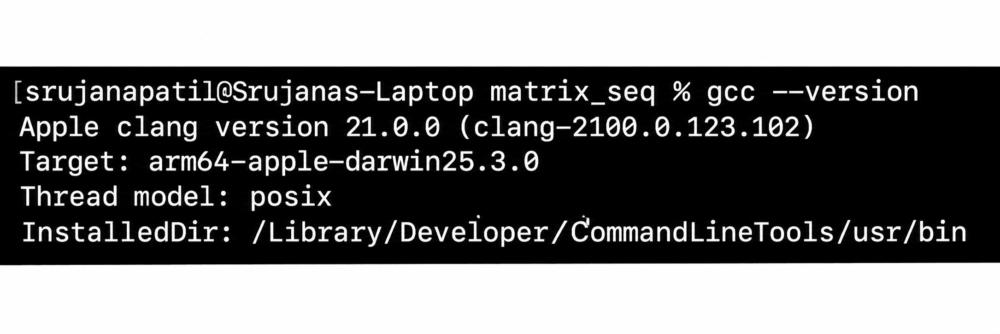
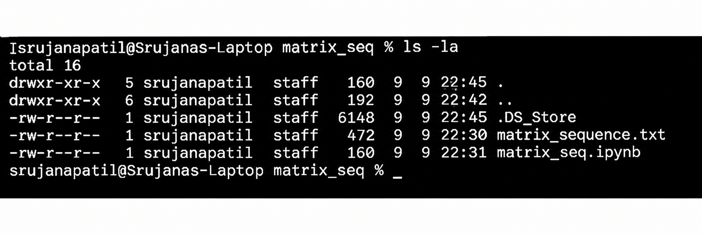
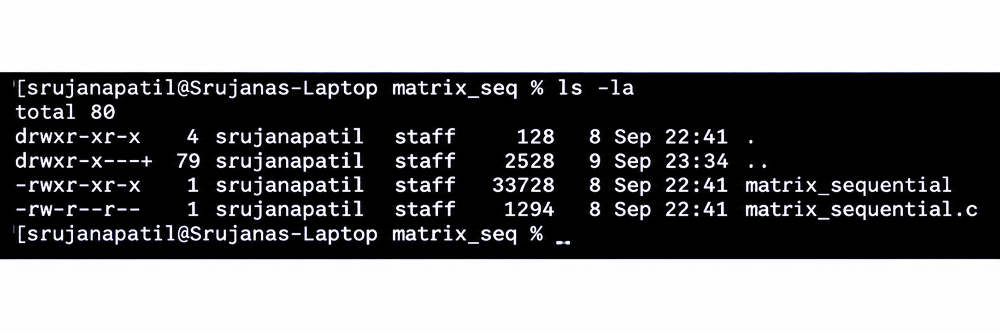

# Experiment 01 — Sequential Matrix Multiplication

## Problem Statement

Matrix multiplication is a fundamental operation in scientific computing and parallel computing. In this experiment, two 4000 × 4000 matrices are multiplied using a sequential CPU implementation. Each element of the input matrices is initialized to 1.0, and the resulting matrix is computed using the standard matrix multiplication method. The sequential implementation serves as the baseline execution against which the performance of OpenMP, MPI, and CUDA implementations can later be compared.

## Objective

To implement and execute matrix multiplication sequentially using C and record the execution time and correctness of the result.

## Implementation

The matrices A and B are initialized with 1.0 values. Matrix C is calculated using three nested loops corresponding to the row, column, and multiplication operations:

`C[i][j] += A[i][k] × B[k][j]`

For a 4000 × 4000 matrix, each element of the resulting matrix is expected to be 4000.00. For example:

`C[0][0] = 1×1 + 1×1 + ... + 1×1 = 4000`

The program was implemented in C and executed in the Ubuntu environment through WSL2 using the GCC compiler.

## Compilation

The sequential program was compiled using:

~~~bash
gcc -O2 matrix_sequential.c -o matrix_sequential
~~~

## Execution

The compiled program was executed using:

~~~bash
./matrix_sequential
~~~

The program displays the matrix size, execution time, and the verification value of `C[0][0]`.

## Result

The sequential matrix multiplication was executed successfully for a 4000 × 4000 matrix.

| Parameter | Result |
|---|---|
| Matrix Size | 4000 × 4000 |
| Implementation | Sequential CPU |
| Verification | `C[0][0] = 4000.00` |
| Execution Time | Add your actual execution time |

The execution time recorded from the actual run is used as the baseline for comparison with the parallel implementations in the later experiments.

## Execution Evidence

### Compiler Version

### Files and Source Code

### Program Output

