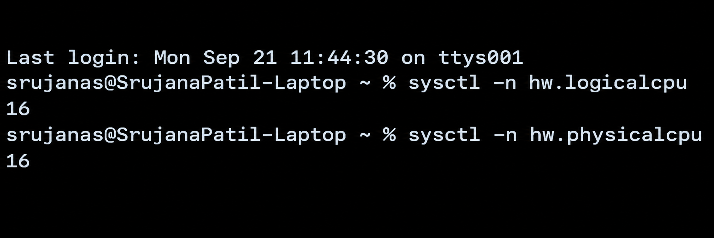
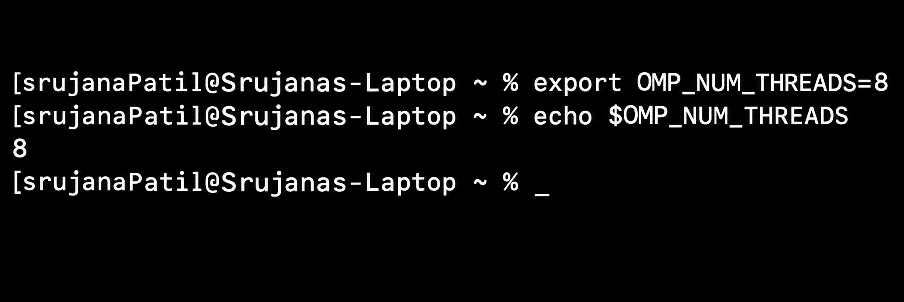
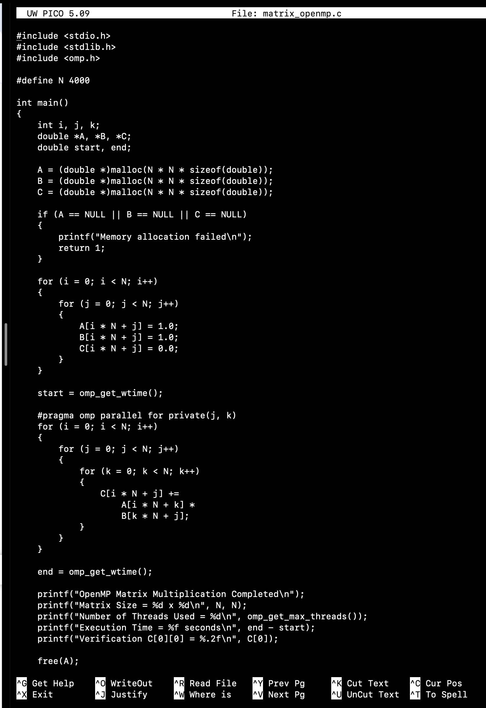
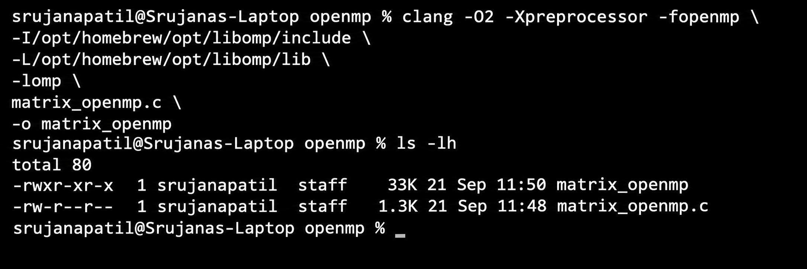
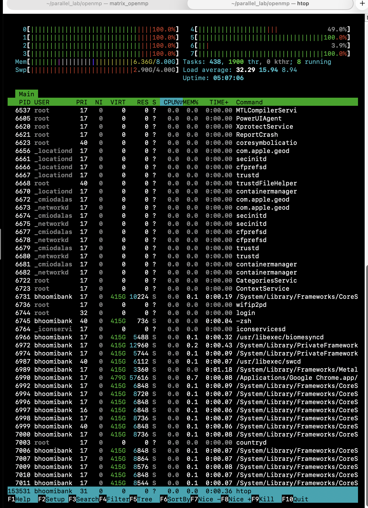
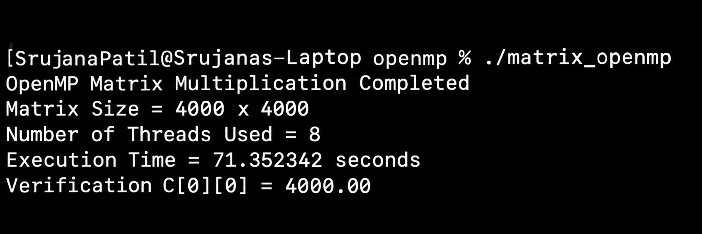

# Experiment 02 — OpenMP Matrix Multiplication

## Objective

To implement and execute matrix multiplication using OpenMP shared-memory parallelism and observe the use of multiple CPU threads during execution.

## Problem Statement

In this experiment, two 4000 × 4000 matrices are multiplied using OpenMP.

Matrix A and Matrix B are initialized with 1.0, and matrix C is calculated as:

`C = A × B`

Since all elements of A and B are 1.0, each element of the resulting matrix is expected to be 4000.00.

For example:

`C[0][0] = 1×1 + 1×1 + ... + 1×1 = 4000.00`

The sequential implementation is used as the baseline, while OpenMP distributes the outer loop of the matrix multiplication among multiple CPU threads.

## Environment

The experiment was performed using:

- Windows PowerShell
- WSL2
- Ubuntu
- GCC Compiler
- OpenMP
- C Programming Language

## CPU Verification

Before executing the OpenMP program, the available CPU resources were verified using:

`nproc`

This confirms the number of processing units available to the Ubuntu environment.

## OpenMP Thread Configuration

The number of OpenMP threads was configured using:

`export OMP_NUM_THREADS=8`

The configured value was verified using:

`echo $OMP_NUM_THREADS`

## Source Code

The OpenMP matrix multiplication program was implemented in C using the source file:

`matrix_openmp.c`

The main parallel section uses the OpenMP directive:

`#pragma omp parallel for private(j, k)`

This distributes the iterations of the outer loop among multiple OpenMP threads while the matrices remain in shared memory.

The execution time is measured using `omp_get_wtime()`.

## Compilation

The program was compiled using GCC with OpenMP support:

`gcc -O2 -fopenmp matrix_openmp.c -o matrix_openmp`

The `-fopenmp` option enables OpenMP support during compilation.

## Execution and CPU Usage

The compiled program was executed using:

`./matrix_openmp`

During execution, `htop` was used to observe CPU utilization and the activity of multiple CPU threads.

`htop`

## Result

The OpenMP matrix multiplication was executed for a 4000 × 4000 matrix.

The program reports the matrix size, number of threads used, execution time, and verification value.

The correctness of the computation is verified using:

`C[0][0] = 4000.00`

The actual execution time and thread count are taken from the recorded output of the experiment.

## Performance Observation

OpenMP uses multiple CPU threads to process different iterations of the matrix multiplication concurrently.

The execution time obtained in this experiment can be compared with the sequential execution time recorded in Experiment 01.

The speedup can be calculated using:

`Speedup = Sequential Execution Time / OpenMP Execution Time`

## Conclusion

The 4000 × 4000 matrix multiplication was successfully implemented using OpenMP shared-memory parallelism. Multiple CPU threads were used during execution, and the result was verified with `C[0][0] = 4000.00`.
