# EXP-03 — MPI Using Matrix Multiplication

> **Distributed-Memory Matrix Multiplication Using Open MPI Across Four Ubuntu Virtual Machines**

)

---

## 📌 Experiment Overview

This experiment implements **4000 × 4000 matrix multiplication using MPI distributed-memory parallelism**.

Unlike sequential execution and OpenMP shared-memory parallelism, MPI uses multiple independent processes running across separate virtual machines. The matrix computation is distributed among the MPI processes, each process performs its assigned computation, and the partial results are gathered to obtain the final matrix.

The experiment uses **one Master VM and three Worker VMs** connected through a common virtual network.

---

## 🎯 Objective

To implement and execute matrix multiplication using **MPI across four Ubuntu virtual machines**, configure inter-node communication, distribute the computation among MPI processes, and verify the correctness of the final result.

---

## 🧮 Problem Definition

Two matrices are multiplied:

- Matrix A: `4000 × 4000`
- Matrix B: `4000 × 4000`
- Matrix C: `A × B`
- Elements of A and B are initialized to `1.0`

Therefore:

    C[0][0] = 1×1 + 1×1 + ... + 1×1
            = 4000.00

Expected verification:

    C[0][0] = 4000.00

---

## 🖥️ MPI Cluster

| Node | Hostname | MPI Role |
|---|---|---|
| Master | `master` | Rank 0 |
| Worker 1 | `worker1` | Rank 1 |
| Worker 2 | `worker2` | Rank 2 |
| Worker 3 | `worker3` | Rank 3 |

The four Ubuntu virtual machines are connected through the same virtual network.

---

## 🔄 MPI Workflow

    Master + 3 Workers
            ↓
    VM Configuration
            ↓
    IP & Hostname Setup
            ↓
    Network Connectivity
            ↓
    SSH Service
            ↓
    Passwordless SSH
            ↓
    Open MPI Installation
            ↓
    MPI Hostfile
            ↓
    MPI 4-Node Test
            ↓
    MPI_Scatter
            ↓
    MPI_Bcast
            ↓
    Local Matrix Computation
            ↓
    MPI_Gather
            ↓
    Final Matrix C
            ↓
    Verify C[0][0] = 4000.00

---

## 🖥️ 1. UTM 4-VM Cluster

Four Ubuntu virtual machines were created and configured for the distributed MPI experiment.

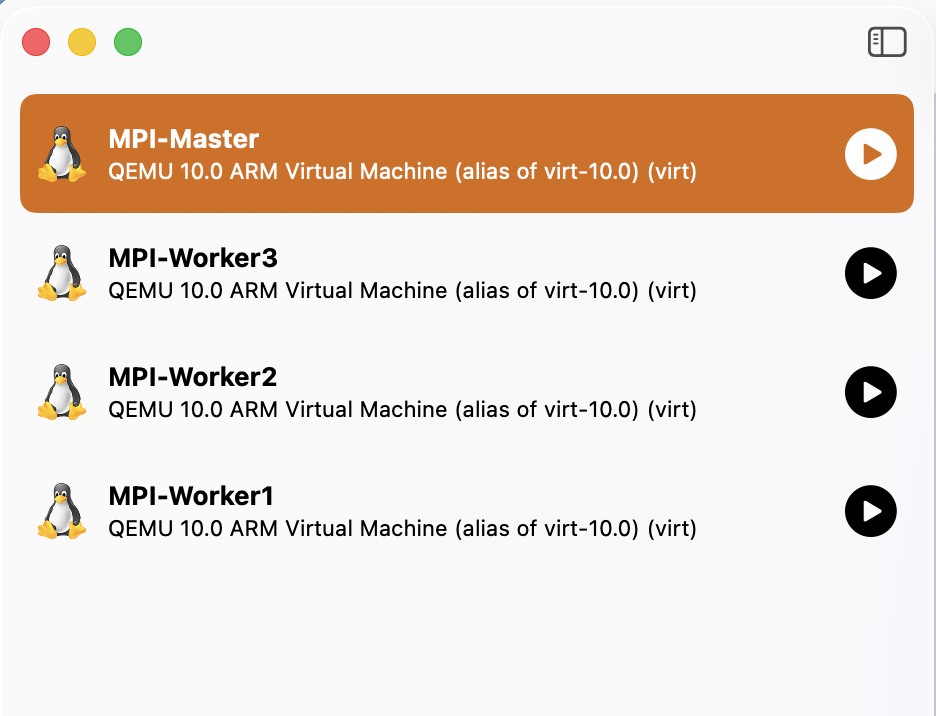

---

## ⚙️ 2. UTM VM Configuration

The virtual machines were configured so that the Master and Worker nodes could communicate and participate in MPI execution.

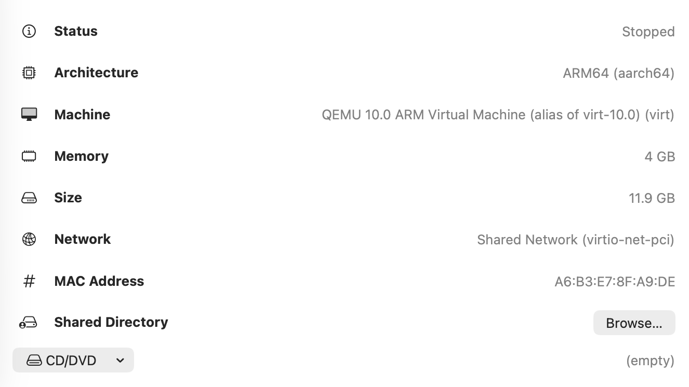

---

## 🌐 3. Master IP and Hostname

The Master node was verified using its hostname and IP address.

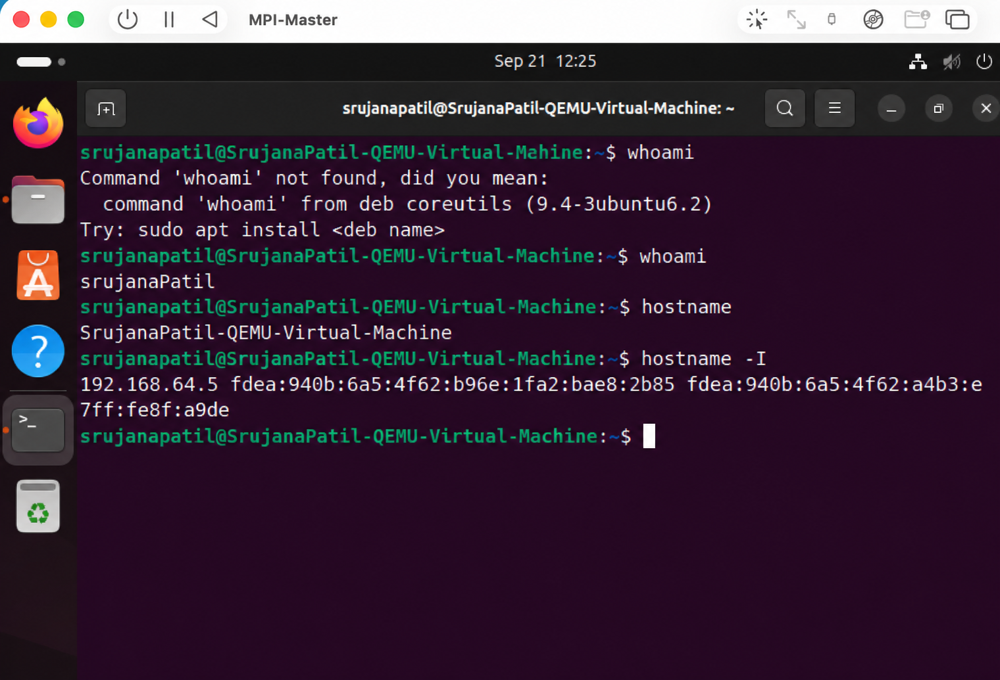

---

## 🌐 4. Worker 1 IP and Hostname

Worker 1 was verified using its hostname and IP address.

---

## 🌐 5. Worker 2 IP and Hostname

Worker 2 was verified using its hostname and IP address.

---

## 🌐 6. Worker 3 IP and Hostname

Worker 3 was verified using its hostname and IP address.

---

## 📡 7. Network Connectivity

The Master node was used to verify connectivity with all Worker nodes.

Successful communication between the nodes is required before launching distributed MPI processes.

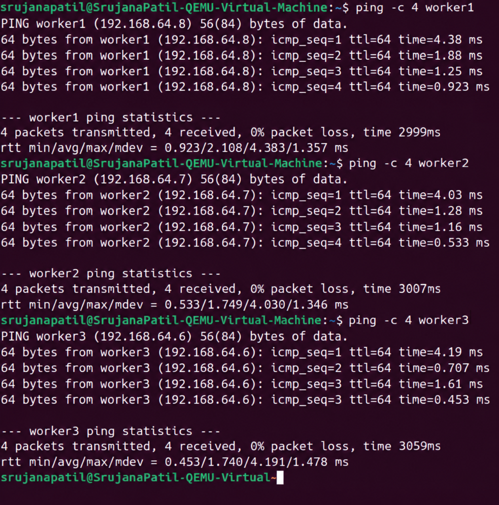

---

## 🔐 8. SSH Service

The SSH service was configured and verified on the required Ubuntu nodes so that the Master could communicate with the Worker nodes.

The SSH service enables remote communication required for distributed MPI execution.

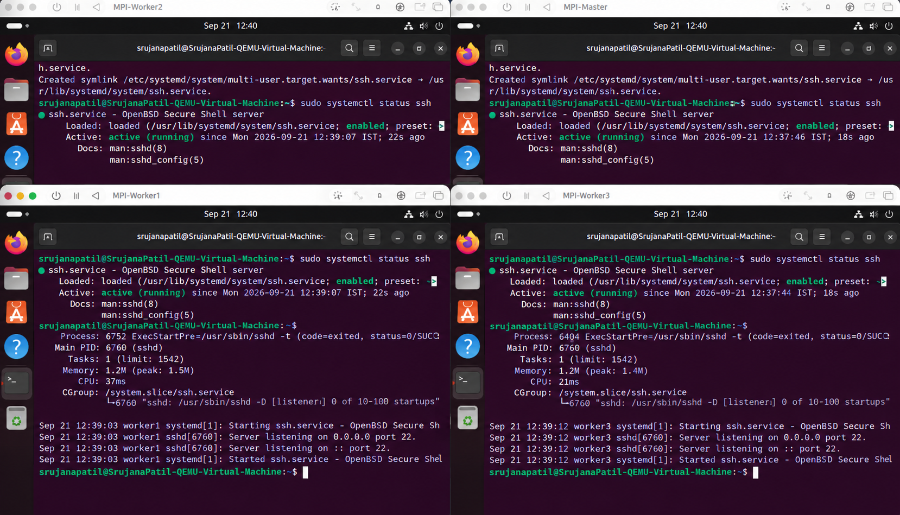

---

## 🔑 9. Passwordless SSH

Passwordless SSH was configured from the Master node to the Worker nodes.

This allows remote MPI processes to be launched without repeatedly entering passwords.

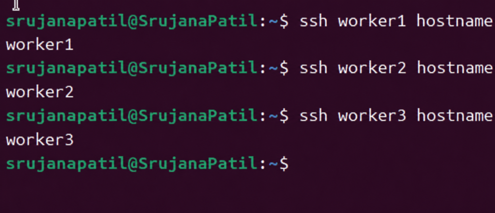

---

## 📦 10. Open MPI Installation

Open MPI and the required development packages were installed on the Ubuntu nodes.

    sudo apt update
    sudo apt install openmpi-bin libopenmpi-dev -y

The MPI environment was verified using:

    mpicc --version
    mpirun --version

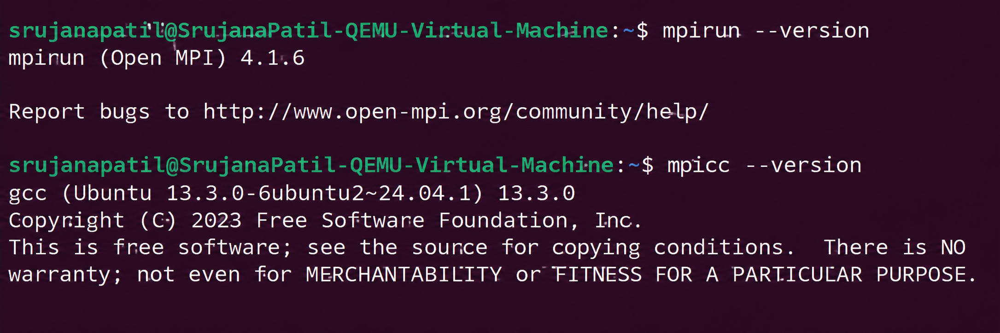

---

## 📄 11. MPI Hostfile

A hostfile was created on the Master node to specify the machines participating in the MPI execution.

    master slots=1
    worker1 slots=1
    worker2 slots=1
    worker3 slots=1

The hostfile allows `mpirun` to identify the four MPI nodes.

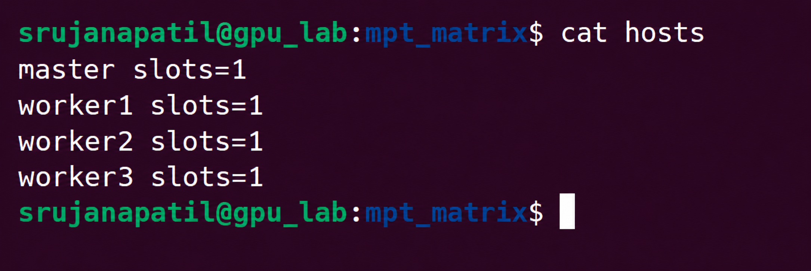

---

## 🧪 12. MPI 4-Node Test

MPI communication was tested across the four configured nodes before running the matrix multiplication program.

The test verifies that MPI can launch processes across the cluster and identify the individual MPI ranks.

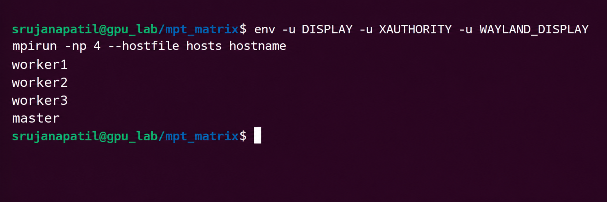

---

## 💻 13. MPI Matrix Multiplication Source Code

The matrix multiplication program was implemented in C using the source file:

    matrix_mpi.c

The program uses the following MPI operations:

- `MPI_Scatter` to distribute portions of Matrix A
- `MPI_Bcast` to make Matrix B available to all processes
- Local matrix multiplication on each process
- `MPI_Gather` to collect the partial results

With four MPI processes, the 4000 rows are divided evenly:

    Rank 0 → 1000 rows
    Rank 1 → 1000 rows
    Rank 2 → 1000 rows
    Rank 3 → 1000 rows

The program is compiled using:

    mpicc -O2 matrix_mpi.c -o matrix_mpi

The executable is copied to the Worker nodes and the MPI program is launched using the configured hostfile:

    mpirun -np 4 --hostfile hosts sh -c '$HOME/matrix_mpi'

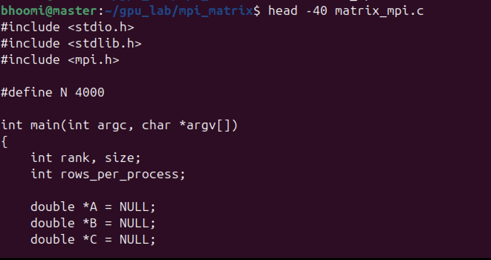

---

## 🔄 MPI Data Flow

    Matrix A (4000 rows)
             |
             v
        MPI_Scatter
             |
      +------+------+------+------+
      |      |      |      |
      v      v      v      v
    Rank 0 Rank 1 Rank 2 Rank 3
    1000   1000   1000   1000
    rows   rows   rows   rows
      |      |      |      |
      +------+------+------+
             |
             v
          MPI_Bcast
             |
          Matrix B
             |
             v
      Local Computation
             |
             v
         MPI_Gather
             |
             v
       Complete Matrix C

---

## 🚀 MPI Execution

The MPI program is launched from the Master node using four MPI processes.

Each process performs its assigned portion of the matrix multiplication. Rank 0 gathers the partial results and produces the final matrix.

The execution flow is:

    MPI_Scatter
          ↓
    MPI_Bcast
          ↓
    Local Matrix Multiplication
          ↓
    MPI_Gather
          ↓
    Final Matrix

---

## ✅ 14. Final MPI Matrix Result

The final output records the matrix size, number of MPI processes, execution time, and verification value.

The correctness of the computation is verified using:

    C[0][0] = 4000.00

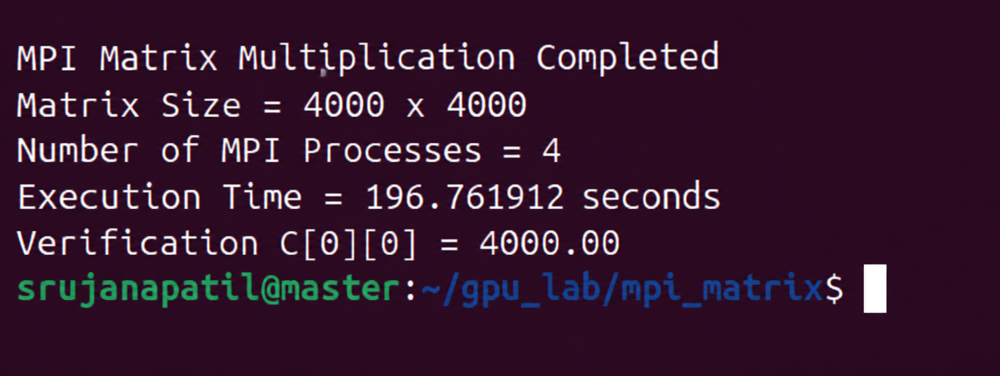

---

## 📊 Result

| Parameter | Result |
|---|---|
| Matrix Size | `4000 × 4000` |
| Implementation | MPI Distributed Memory |
| Number of MPI Processes | `4` |
| Cluster | `1 Master + 3 Workers` |
| Verification | `C[0][0] = 4000.00` |
| Execution Time | Recorded in final output |

---

## 💡 Performance Observation

MPI demonstrates **distributed-memory parallelism**, where independent processes run across separate virtual machines and communicate explicitly to exchange data.

The computation is distributed across four MPI processes, with each process handling 1000 rows of the matrix.

The MPI execution time can be compared with the sequential and OpenMP implementations from the previous experiments.

Speedup can be calculated using:

    Speedup = Sequential Execution Time / MPI Execution Time

---

## 🔍 Key MPI Operations

| MPI Operation | Purpose |
|---|---|
| `MPI_Init()` | Initializes the MPI environment |
| `MPI_Comm_rank()` | Identifies the rank of each process |
| `MPI_Comm_size()` | Determines the number of MPI processes |
| `MPI_Scatter()` | Distributes portions of Matrix A |
| `MPI_Bcast()` | Broadcasts Matrix B to all processes |
| `MPI_Gather()` | Collects partial results into Matrix C |
| `MPI_Finalize()` | Terminates the MPI environment |

---

## 🏁 Conclusion

The **4000 × 4000 matrix multiplication** was successfully implemented using **MPI distributed-memory parallelism across four Ubuntu virtual machines**.

The experiment covered:

- Four-VM cluster configuration
- IP and hostname verification
- Network connectivity
- SSH configuration
- Passwordless SSH
- Open MPI installation
- MPI hostfile configuration
- Four-node MPI testing
- Distributed matrix multiplication
- Final result verification

The final computation was verified using:

    C[0][0] = 4000.00

This experiment demonstrates how MPI distributes computation across multiple machines using explicit inter-process communication.
