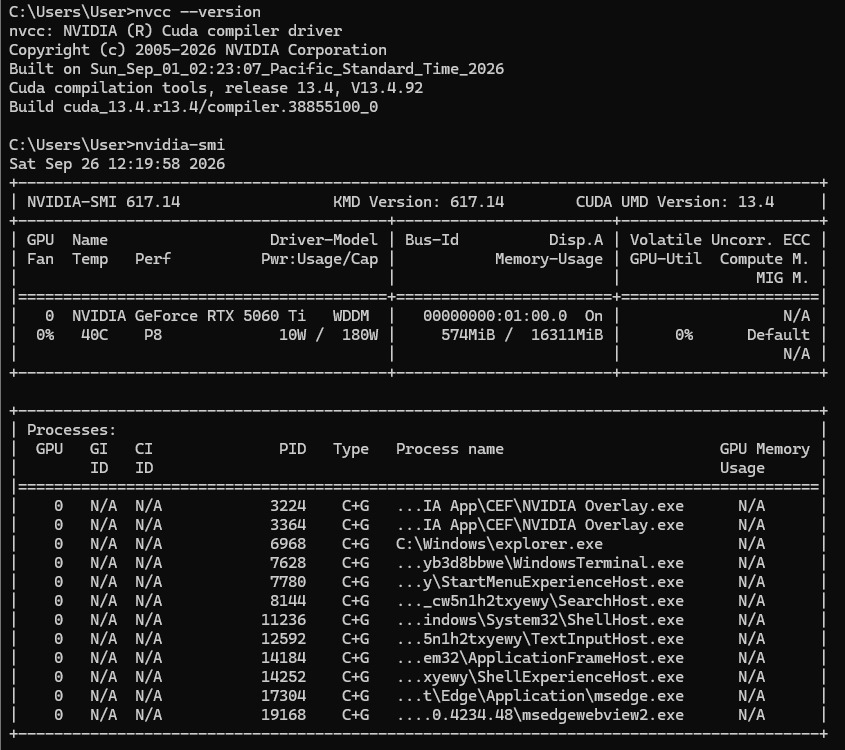
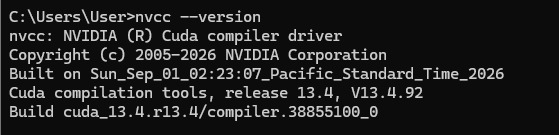
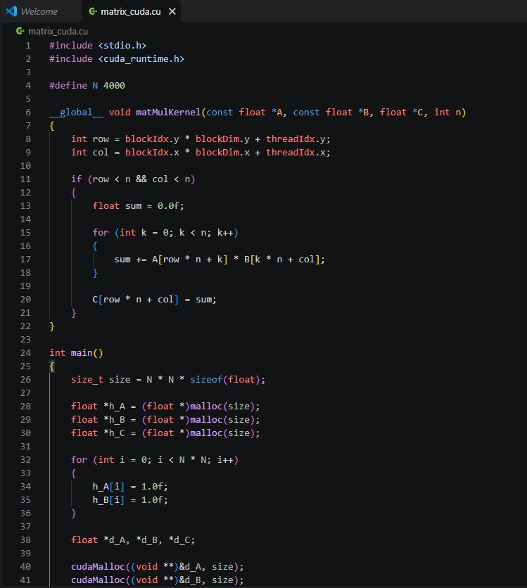

# EXP-04 — CUDA Using Matrix Multiplication

> **GPU-Accelerated Matrix Multiplication Using CUDA on an NVIDIA GPU**

---

## 📌 Experiment Overview

This experiment implements **4000 × 4000 matrix multiplication using CUDA GPU parallelism**.

Unlike the sequential, OpenMP, and MPI implementations, CUDA offloads the matrix multiplication computation from the CPU to an NVIDIA GPU. The CPU prepares the input matrices and transfers them to GPU memory. A CUDA kernel is then launched, where GPU threads compute the output matrix in parallel.

The experiment covers GPU verification, CUDA compiler verification, CUDA source code, compilation, execution configuration, and final result verification.

---

## 🎯 Objective

To implement and execute matrix multiplication using **CUDA on an NVIDIA GPU**, understand the organization of CUDA blocks and threads, measure GPU execution time, and verify the correctness of the computed matrix.

---

## 🧮 Problem Definition

Two matrices are multiplied:

- Matrix A: `4000 × 4000`
- Matrix B: `4000 × 4000`
- Matrix C: `A × B`
- Elements of A and B are initialized to `1.0`

Therefore:

    C[0][0] = 1×1 + 1×1 + ... + 1×1
            = 4000.00

Expected verification:

    C[0][0] = 4000.00

---

## ⚡ CUDA Execution Flow

    Host CPU
        ↓
    Initialize Matrix A and Matrix B
        ↓
    Allocate GPU Memory
        ↓
    Copy A and B to GPU
        ↓
    Launch CUDA Kernel
        ↓
    GPU Threads Compute Matrix C
        ↓
    Copy Matrix C back to CPU
        ↓
    Verify C[0][0] = 4000.00

---

## 🖥️ 1. GPU Verification

Before executing the CUDA program, the NVIDIA GPU environment was verified using:

    nvidia-smi

This command is used to confirm that the NVIDIA driver can detect the available GPU.

---

## 🧰 2. CUDA Compiler Verification

The CUDA compiler was verified using:

    nvcc --version

This confirms that the CUDA Toolkit and `nvcc` compiler are available for compiling CUDA source files.

---

## 💻 3. CUDA Source Code

The CUDA matrix multiplication program was implemented using the source file:

    matrix_cuda.cu

The CUDA kernel calculates one output element of matrix C for each logical GPU thread.

The row and column of each element are identified using:

    int row = blockIdx.y * blockDim.y + threadIdx.y;
    int col = blockIdx.x * blockDim.x + threadIdx.x;

The kernel then performs the matrix multiplication for that output element.

---

## 🔨 4. CUDA Compilation

The CUDA program was compiled using `nvcc`:

    nvcc -O2 matrix_cuda.cu -o matrix_cuda

The `nvcc` compiler handles the CUDA source code and prepares the executable for GPU execution.

After successful compilation, the executable is:

    matrix_cuda

---

## 🧩 CUDA Execution Configuration

The experiment uses:

| Parameter | Configuration |
|---|---|
| Matrix Size | `4000 × 4000` |
| Block Size | `16 × 16` threads |
| Threads per Block | `256` |
| Grid Size | `250 × 250` blocks |
| Total Blocks | `62,500` |
| Logical CUDA Threads | `16,000,000` |

Since:

    4000 / 16 = 250

the grid requires `250 × 250` blocks.

Each block contains:

    16 × 16 = 256 threads

Therefore:

    62,500 × 256 = 16,000,000

logical thread instances are launched.

---

## 🚀 CUDA Execution

The compiled CUDA program is executed using:

    ./matrix_cuda

During execution:

1. Matrix A and Matrix B are stored in host memory.
2. GPU memory is allocated.
3. The matrices are transferred from CPU memory to GPU memory.
4. The CUDA kernel is launched.
5. GPU threads calculate the output matrix.
6. The resulting matrix is copied back to the CPU.
7. The output is verified.

---

## ✅ Final CUDA Result

The program reports:

- Matrix size
- Grid size
- Block size
- Kernel execution time
- Total CUDA phase time
- Verification value

The correctness of the computation is verified using:

    C[0][0] = 4000.00

The actual execution time should be taken from the output generated during the experiment.

---

## 📊 Result

| Parameter | Result |
|---|---|
| Matrix Size | `4000 × 4000` |
| Implementation | CUDA GPU Parallelism |
| Block Size | `16 × 16` |
| Grid Size | `250 × 250` |
| Verification | `C[0][0] = 4000.00` |
| Kernel Execution Time | Recorded in final output |
| Total CUDA Phase Time | Recorded in final output |

The **Total CUDA Phase Time** includes the GPU-related phase measured by the program, including memory transfers and kernel execution as defined by the implementation.

---

## 🔍 CUDA Kernel Concept

The CUDA implementation maps the output matrix onto GPU threads.

Conceptually:

    Thread → One output element C[row][col]

For every output element:

    C[row][col] =
        A[row][0] × B[0][col] +
        A[row][1] × B[1][col] +
        ...
        A[row][3999] × B[3999][col]

This allows a large number of output elements to be processed in parallel by GPU threads.

---

## ⚙️ CUDA Memory Flow

    CPU Memory
        |
        |  Host → Device
        v
    GPU Memory
        |
        |  CUDA Kernel
        v
    Matrix C on GPU
        |
        |  Device → Host
        v
    CPU Memory
        |
        v
    Verification

---

## 📈 Performance Observation

CUDA uses massive thread-level parallelism to perform the matrix multiplication on the GPU.

The CUDA execution time can be compared with the sequential, OpenMP, and MPI implementations from the previous experiments.

The speedup can be calculated using:

    Speedup = Sequential Execution Time / CUDA Execution Time

For comparison, the execution time recorded in the final CUDA output should be used.

---

## 📸 Screenshots

The screenshots document the complete CUDA workflow:

1. GPU verification
2. CUDA compiler verification
3. CUDA source code
4. CUDA compilation
5. CUDA execution configuration
6. Final CUDA result

---

## 🏁 Conclusion

The **4000 × 4000 matrix multiplication** was successfully implemented using **CUDA GPU parallelism**.

The experiment covered:

- NVIDIA GPU verification
- CUDA compiler verification
- CUDA source implementation
- CUDA compilation using `nvcc`
- Grid and block configuration
- GPU kernel execution
- Result verification
- CUDA performance measurement

The final computation was verified using:

    C[0][0] = 4000.00

This experiment demonstrates how CUDA uses GPU threads, blocks, and grids to execute matrix multiplication in parallel.
