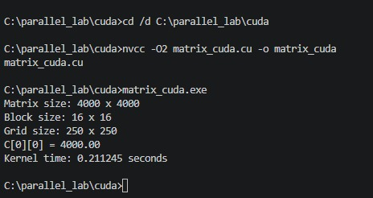

# EXP-04 — CUDA Using Matrix Multiplication

> **GPU-Accelerated Matrix Multiplication Using CUDA on an NVIDIA GPU**

---

## 📌 Experiment Overview

This experiment implements **4000 × 4000 matrix multiplication using CUDA GPU parallelism**.

Unlike sequential execution, OpenMP shared-memory parallelism, and MPI distributed-memory parallelism, CUDA offloads the matrix multiplication computation to an NVIDIA GPU. The CPU prepares the input matrices and transfers them to GPU memory. A CUDA kernel is then launched, where GPU threads compute the output matrix in parallel.

---

## 🎯 Objective

To implement and execute matrix multiplication using **CUDA on an NVIDIA GPU**, understand CUDA thread and block organization, measure GPU execution time, and verify the correctness of the computed matrix.

---

## 🧮 Problem Definition

Two matrices are multiplied:

- Matrix A: `4000 × 4000`
- Matrix B: `4000 × 4000`
- Matrix C: `A × B`
- Elements of A and B are initialized to `1.0`

Therefore:

    C[0][0] = 1×1 + 1×1 + ... + 1×1
            = 4000.00

Expected verification:

    C[0][0] = 4000.00

---

## ⚡ CUDA Execution Flow

    Host CPU
        ↓
    Initialize Matrix A and Matrix B
        ↓
    Allocate GPU Memory
        ↓
    Copy A and B to GPU
        ↓
    Launch CUDA Kernel
        ↓
    GPU Threads Compute Matrix C
        ↓
    Copy Matrix C back to CPU
        ↓
    Verify C[0][0] = 4000.00

---

## 🖥️ 1. GPU Verification

Before executing the CUDA program, the NVIDIA GPU environment was verified using:

    nvidia-smi

This confirms that the NVIDIA driver can detect the available GPU.

---

## 🧰 2. CUDA Compiler Verification

The CUDA compiler was verified using:

    nvcc --version

This confirms that the CUDA Toolkit and `nvcc` compiler are available for compiling CUDA source files.

---

## 💻 3. CUDA Source Code

The CUDA matrix multiplication program was implemented using the source file:

    matrix_cuda.cu

The CUDA kernel calculates one output element of matrix C for each logical GPU thread.

The row and column of each output element are determined using:

    int row = blockIdx.y * blockDim.y + threadIdx.y;
    int col = blockIdx.x * blockDim.x + threadIdx.x;

The kernel then performs the matrix multiplication for that output element.

---

## 🔨 4. Compilation and Execution

The CUDA program is compiled using `nvcc`:

    nvcc -O2 matrix_cuda.cu -o matrix_cuda

After successful compilation, the executable is:

    matrix_cuda

The program is executed using:

    ./matrix_cuda

During execution:

1. Matrix A and Matrix B are initialized in host memory.
2. GPU memory is allocated.
3. The matrices are transferred from CPU memory to GPU memory.
4. The CUDA kernel is launched.
5. GPU threads compute the output matrix.
6. The resulting matrix is copied back to the CPU.
7. The output is verified.

---

## 🧩 CUDA Execution Configuration

The experiment uses the following configuration:

| Parameter | Configuration |
|---|---|
| Matrix Size | `4000 × 4000` |
| Block Size | `16 × 16` threads |
| Threads per Block | `256` |
| Grid Size | `250 × 250` blocks |
| Total Blocks | `62,500` |
| Logical CUDA Threads | `16,000,000` |

Since:

    4000 / 16 = 250

the grid consists of:

    250 × 250 = 62,500 blocks

Each block contains:

    16 × 16 = 256 threads

Therefore:

    62,500 × 256 = 16,000,000

logical CUDA thread instances are launched.

---

## 🚀 CUDA Kernel Concept

The CUDA implementation maps the output matrix onto GPU threads.

Conceptually:

    One CUDA thread → One output element C[row][col]

For every output element:

    C[row][col] =
        A[row][0] × B[0][col] +
        A[row][1] × B[1][col] +
        ...
        A[row][3999] × B[3999][col]

This allows many output elements to be processed concurrently by GPU threads.

---

## ⚙️ CUDA Memory Flow

    CPU Memory
        |
        | Host → Device
        v
    GPU Memory
        |
        | CUDA Kernel
        v
    Matrix C on GPU
        |
        | Device → Host
        v
    CPU Memory
        |
        v
    Verification

---

## ✅ 5. Final CUDA Result

The final program output reports:

- Matrix size
- Grid size
- Block size
- Kernel execution time
- Total CUDA phase time
- Verification value

The correctness of the computation is verified using:

    C[0][0] = 4000.00

---

## 📊 Result

| Parameter | Result |
|---|---|
| Matrix Size | `4000 × 4000` |
| Implementation | CUDA GPU Parallelism |
| Block Size | `16 × 16` |
| Grid Size | `250 × 250` |
| Verification | `C[0][0] = 4000.00` |
| Kernel Execution Time | Recorded in final output |
| Total CUDA Phase Time | Recorded in final output |

The execution times should be taken directly from the final CUDA output.

---

## 📈 Performance Observation

CUDA uses GPU thread-level parallelism to perform matrix multiplication.

The CUDA execution time can be compared with the sequential, OpenMP, and MPI implementations from the previous experiments.

The speedup can be calculated using:

    Speedup = Sequential Execution Time / CUDA Execution Time

The actual values should be taken from the recorded experiment outputs.

---

## 📸 Screenshots

The experiment contains four screenshots documenting the main stages:

1. GPU verification
2. CUDA compiler verification
3. CUDA source code
4. Final CUDA result

---

## 🏁 Conclusion

The **4000 × 4000 matrix multiplication** was successfully implemented using **CUDA GPU parallelism**.

The experiment covered:

- NVIDIA GPU verification
- CUDA compiler verification
- CUDA source implementation
- CUDA compilation using `nvcc`
- CUDA grid and block configuration
- GPU kernel execution
- Result verification
- CUDA performance measurement

The final computation was verified using:

    C[0][0] = 4000.00

This experiment demonstrates the use of CUDA threads, blocks, and grids for parallel matrix multiplication on an NVIDIA GPU.
